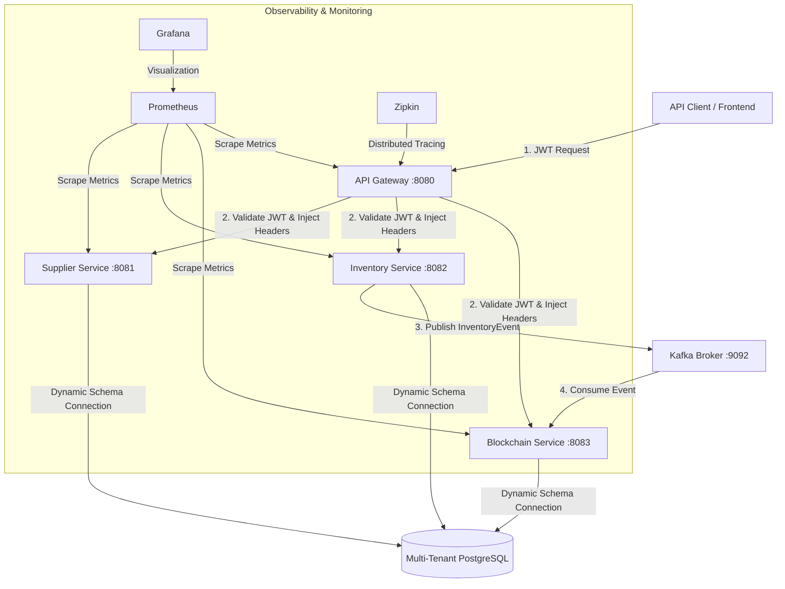

# Comprehensive Guide: Multi-Tenant Supply Chain & Private Blockchain Audit Ledger Platform

Indonesian version: [README_ID.md](README_ID.md)

An enterprise-grade **Multi-Tenant Supply Chain & Inventory Platform** with an immutable **Private Blockchain Audit Trail**. This project is designed as a Senior Java Engineer portfolio piece, implementing a robust, secure, and observable modern microservices architecture.

The system is built with **Java 21**, **Spring Boot 3.3.x**, **Apache Kafka**, **PostgreSQL** (using a *schema-per-tenant* isolation approach), **Spring Cloud Gateway**, **Docker**, and a full monitoring and observability stack.

---

## 🏗️ 1. Architecture & Service Details

### System Flow Diagram



### End-to-End Flow

1. **Authentication & routing**: The client sends requests with a JWT in the HTTP header. The **API Gateway** validates the token, extracts `tenantId`, username (`sub`), and role (`role`), then injects them as custom headers (`X-Tenant-Id`, `X-Username`, `X-User-Role`) for downstream services.
2. **Tenant propagation (database isolation)**: Downstream services receive requests through `JwtAuthFilter`, which sets the tenant ID in the thread-local `TenantContext`. When Hibernate/Spring Data JPA runs queries, `TenantRoutingDataSource` detects the tenant ID and selects the matching PostgreSQL schema (e.g. `toyota`, `honda`, etc.).
3. **Event publishing**: Whenever an inventory transaction is processed successfully (e.g. receipt), the **Inventory Service** persists the transaction locally and publishes an `InventoryEvent` to Kafka with `tenantId` as the partition key to preserve ordering per tenant.
4. **Cryptographic audit (blockchain ledger)**: The **Blockchain Ledger Service** consumes messages from Kafka. On receipt, it activates the correct tenant schema and wraps the event in a new block cryptographically linked to the previous block using SHA-256.

### Service Roles

1. **API Gateway (`api-gateway`)**
   - Built on **Spring Cloud Gateway**.
   - Centralized JWT validation filter.
   - Extracts `tenantId` from JWT claims and injects it into downstream request headers.
   - Request rate limiting.
   - Dynamic routing to all microservices.

2. **Supplier Service (`supplier-service`)**
   - Manages supplier master data (CRUD).
   - Validates supplier status (Pending, Active, Suspended, Blacklisted).
   - Documented REST API for supplier data integration.

3. **Inventory Service (`inventory-service`) — core service**
   - Material and category management.
   - Physical warehouse/location management.
   - Inventory stock mutations (CRUD and stock transactions).
   - Transaction types: `RECEIPT`, `TRANSFER`, `RESERVE`, `ISSUE`, `ADJUSTMENT`.
   - Publishes mutation events to Apache Kafka.
   - Traceability queries, optimistic locking, and idempotency keys for concurrency safety.

4. **Blockchain Ledger Service (`blockchain-ledger-service`)**
   - Kafka consumer for inventory events.
   - Creates new audit blocks with SHA-256 chaining.
   - Full blockchain chain integrity validation.
   - Verification API for auditors.

---

## 🛠️ 2. Technology Stack & Security Features

### Main Technology Table

| Layer / Component | Technology |
|---|---|
| **Language** | Java 21 (LTS) |
| **Framework** | Spring Boot 3.3.x / Spring Cloud |
| **Security** | Spring Security + JWT (JJWT 0.12) |
| **Messaging** | Apache Kafka 7.6 (Confluent, KRaft mode — no ZooKeeper) |
| **Database** | PostgreSQL 16 |
| **Migration** | Flyway (multi-schema dynamic migration) |
| **ORM** | Spring Data JPA + Hibernate |
| **Observability** | Micrometer + Prometheus + Grafana |
| **Distributed tracing** | OpenTelemetry + Zipkin |
| **Testing** | JUnit 5, Testcontainers, Mockito, MockMvc |
| **Containerization** | Docker Compose (runtime images only, JRE-based) |
| **CI/CD pipeline** | GitHub Actions |
| **Build tool** | Maven (compile on host; cache `~/.m2` / `%USERPROFILE%\.m2`) |

### Production-Grade Security Features

* **Stateless JWT authentication & RBAC**: Stateless authentication with cryptographically secured JWT tokens. Role-based authorization via `@PreAuthorize` on controllers (roles: `ADMIN`, `WAREHOUSE`, `AUDITOR`, `SUPPLIER`).
* **Multi-schema database isolation**: Tenant data is physically separated at the PostgreSQL schema level to prevent cross-tenant data leakage.
* **Idempotency guard**: Unique `X-Idempotency-Key` (UUID-based) on every stock write transaction to prevent duplicate execution from network failures or client retries.
* **Optimistic locking**: JPA `@Version` column on the `inventory` table to handle concurrent stock update race conditions safely.
* **Transactional outbox**: Inventory mutations and Kafka payloads are committed in one local DB transaction; `OutboxMessageRelay` publishes pending rows to Kafka asynchronously.
* **Kafka reliable delivery & DLQ**: Kafka configured with `enable.idempotence=true` and `acks=all` to avoid lost transactions. Events that fail after retries are routed to a Dead Letter Queue (DLQ) so the main flow is not blocked.
* **Distributed tracing**: OpenTelemetry and Zipkin integration to trace end-to-end request paths across microservices for latency debugging.
* **Observability & metrics**: Application metrics exposed via Micrometer/Prometheus Actuator and visualized in Grafana dashboards.

---

## 📂 3. Module & Project Structure (Monorepo)

The application uses a Maven multi-module layout in a single repository (monorepo) for unified dependency management, Docker configuration, and deployment:

```
supply-chain-platform/
│
├── pom.xml (Parent POM — manages dependency versions & child modules)
├── docker-compose.yml (PostgreSQL, Kafka, Zipkin, gateway & app services)
├── docker-compose.monitoring.yml (Prometheus & Grafana)
├── README_ID.md (Indonesian documentation)
├── .github/workflows/ci.yml (GitHub Actions CI/CD pipeline)
│
├── common/ (Shared library used by downstream services)
│   ├── pom.xml
│   └── src/main/java/com/supplychain/common/
│       ├── dto/ (ApiResponse.java — standard REST response format)
│       ├── event/ (InventoryEvent.java — Kafka event payload)
│       ├── exception/ (ResourceNotFoundException.java)
│       ├── security/ (JwtUtil.java — JWT validation at library level)
│       └── tenant/ (TenantContext.java — thread-local tenant ID)
│
├── api-gateway/ (Routing & centralized security)
│   ├── pom.xml
│   ├── Dockerfile          # Runtime-only: COPY target/*.jar (no Maven stage)
│   └── src/main/
│       ├── java/com/supplychain/gateway/
│       │   ├── ApiGatewayApplication.java
│       │   ├── config/ (SecurityConfig.java, JwtAuthGatewayFilter.java)
│       │   ├── controller/ (AuthController.java)
│       │   ├── dto/ (LoginRequest.java, AuthResponse.java)
│       │   └── service/ (AuthService.java)
│       └── resources/
│           └── application.yml (microservice routes & gateway rules)
│
├── supplier-service/ (Supplier master data)
│   ├── pom.xml
│   ├── Dockerfile          # Runtime-only: COPY target/*.jar
│   └── src/main/
│       ├── java/com/supplychain/supplier/
│       │   ├── SupplierServiceApplication.java
│       │   ├── config/ (JwtAuthFilter.java, TenantDataSourceConfig.java, SecurityConfig.java, FlywayTenantMigration.java)
│       │   ├── controller/ (SupplierController.java)
│       │   ├── entity/ (Supplier.java, SupplierContact.java)
│       │   ├── repository/ (SupplierRepository.java)
│       │   └── service/ (SupplierService.java)
│       └── resources/
│           ├── application.yml
│           └── db/migration/ (V1__init_supplier.sql)
│
├── inventory-service/ (Core stock & warehouse transactions)
│   ├── pom.xml
│   ├── Dockerfile          # Runtime-only: COPY target/*.jar
│   └── src/main/
│       ├── java/com/supplychain/inventory/
│       │   ├── InventoryServiceApplication.java
│       │   ├── config/ (TenantDataSourceConfig.java, SecurityConfig.java, FlywayTenantMigration.java, KafkaProducerConfig.java)
│       │   ├── controller/ (InventoryController.java, MaterialController.java, WarehouseController.java, TraceabilityController.java)
│       │   ├── dto/ (ReceiptRequest.java, TransferRequest.java, IssueRequest.java, AdjustmentRequest.java, InventoryTransactionResponse.java)
│       │   ├── entity/ (Material.java, Warehouse.java, Inventory.java, InventoryTransaction.java, AuditLog.java)
│       │   ├── event/ (InventoryEventFactory.java — event payload builder)
│       │   ├── outbox/ (OutboxService, OutboxMessageRelay — transactional outbox)
│       │   ├── repository/ (MaterialRepository.java, WarehouseRepository.java, InventoryRepository.java, InventoryTransactionRepository.java, AuditLogRepository.java)
│       │   └── service/ (InventoryService.java, MaterialService.java, WarehouseService.java, TraceabilityService.java)
│       └── resources/
│           ├── application.yml
│           └── db/migration/ (V1__init_inventory.sql)
│
└── blockchain-ledger-service/ (Immutable cryptographic audit ledger)
    ├── pom.xml
    ├── Dockerfile          # Runtime-only: COPY target/*.jar
    └── src/main/
        ├── java/com/supplychain/blockchain/
        │   ├── BlockchainLedgerApplication.java
        │   ├── config/ (TenantDataSourceConfig.java, SecurityConfig.java, FlywayTenantMigration.java, KafkaConsumerConfig.java)
        │   ├── controller/ (ChainVerificationController.java)
        │   ├── entity/ (Block.java)
        │   ├── event/ (InventoryEventConsumer.java — Kafka consumer)
        │   ├── repository/ (BlockRepository.java)
        │   └── service/ (BlockchainService.java)
        └── resources/
            ├── application.yml
            └── db/migration/ (V1__init_blockchain.sql)
```

---

## ⚡ 4. Key Technical Implementations

### Multi-Tenancy Strategy

The system uses dynamic **schema-per-tenant** isolation.

1. A `ThreadLocal`-based `TenantContext` stores the current tenant in the execution thread.
2. `AbstractRoutingDataSource` routes database connections dynamically based on the active tenant ID.
3. JWT claims include tenant information:
   ```json
   {
     "sub": "user1",
     "tenantId": "toyota",
     "role": "WAREHOUSE"
   }
   ```
4. **Flyway** runs dynamically at startup to migrate all registered tenant schemas.

### Cryptographic Blockchain Audit Flow

Every significant stock mutation is archived in an encrypted audit store.

- **Hash formula**:
  ```java
  hash = SHA256(previousHash + transactionId + payload + timestamp)
  ```
- **Genesis block**: Created automatically for each new tenant when the chain is empty.
- **Chain validation**: The chain is verified from the first block to the last. Manual database tampering breaks hash linkage and integrity returns `false`.

To avoid duplicate blocks when Kafka redelivers the same event (At-Least-Once delivery), the Blockchain consumer records processed event IDs in a `processed_events` table and uses an idempotent append API (`addBlockIfNotProcessed(eventId, ...)`) so repeated deliveries do not create duplicate ledger entries.

### Kafka Data Flow Integration (Transactional Outbox)

```
[Inventory Service]
   │  @Transactional: stock + audit_log + outbox_events (PENDING)
   ▼
[OutboxMessageRelay scheduler] ─── publish ───> [Kafka Topic: inventory-events]
                                                                │
                                                                ▼
                                                    [Blockchain Ledger Service]
                                                   (Read & Validate Event)
                                                                │
                                                                ▼
                                                    (Persist New Audit Block)
```

If Kafka is temporarily unavailable, rows stay `PENDING` and are retried; the database and outbox remain consistent.

---

## 💾 5. Per-Tenant Database Schema Structure

The database uses physical schema-level isolation. Default tenant schemas include `toyota`, `honda`, `mitsubishi`, and `daihatsu`. Flyway creates the following tables in each schema:

### A. Supplier Service Schema

* **`suppliers`**: Supplier master data.
  - `id` (BIGSERIAL, PK)
  - `supplier_code` (VARCHAR, UNIQUE)
  - `supplier_name` (VARCHAR)
  - `tax_number`, `email`, `phone`, `address`, `city`, `country`
  - `status` (VARCHAR — PENDING, ACTIVE, SUSPENDED, BLACKLISTED)
* **`supplier_contacts`**: Supplier contact persons.
  - `id` (BIGSERIAL, PK)
  - `supplier_id` (FK to `suppliers`)
  - `contact_name`, `contact_email`, `contact_phone`, `role`
  - `is_primary` (BOOLEAN)

### B. Inventory Service Schema

* **`materials`**: Material/item master data.
  - `id` (BIGSERIAL, PK)
  - `material_code` (VARCHAR, UNIQUE)
  - `material_name` (VARCHAR), `category` (VARCHAR), `unit` (VARCHAR)
  - `min_stock_level` (INTEGER), `active` (BOOLEAN)
* **`warehouses`**: Physical warehouse list.
  - `id` (BIGSERIAL, PK)
  - `warehouse_code` (VARCHAR, UNIQUE), `warehouse_name` (VARCHAR), `warehouse_type` (VARCHAR)
* **`inventory`**: Current stock balance per material and warehouse.
  - `id` (BIGSERIAL, PK)
  - `material_id` (FK), `warehouse_id` (FK)
  - `quantity` (DECIMAL), `reserved_quantity` (DECIMAL)
  - `version` (BIGINT) — **optimistic locking column (`@Version`)**
* **`inventory_transactions`**: Immutable stock mutation ledger.
  - `id` (BIGSERIAL, PK)
  - `trx_no` (VARCHAR, UNIQUE)
  - `idempotency_key` (VARCHAR, UNIQUE) — **prevents duplicate operations**
  - `material_id` (FK), `source_warehouse_id` (FK), `destination_warehouse_id` (FK)
  - `trx_type` (RECEIPT, TRANSFER, ISSUE, ADJUSTMENT), `quantity` (DECIMAL), `performed_by` (VARCHAR), `trx_time` (TIMESTAMP)
* **`audit_logs`**: System records for compliance.
  - `id` (BIGSERIAL, PK)
  - `entity_name`, `entity_id`, `action_type`, `performed_by`, `tenant_id`, `details` (JSON)
* **`outbox_events`**: Transactional outbox for Kafka relay (`PENDING` → `SENT` / `FAILED`).
  - `event_id` (VARCHAR, UNIQUE), `payload` (TEXT), `status`, `retry_count`, `sent_at`

### C. Blockchain Ledger Service Schema

* **`blockchain_blocks`**: Cryptographic audit trail blocks.
  - `id` (BIGSERIAL, PK)
  - `block_index` (BIGINT) — block height
  - `timestamp` (TIMESTAMP) — block creation time
  - `payload` (VARCHAR(2000)) — raw inventory transaction copy
  - `previous_hash` (VARCHAR(64)) — link to previous block
  - `hash` (VARCHAR(64), UNIQUE) — SHA-256 hash of current block
  - `transaction_no` (VARCHAR(50)) — related inventory transaction number

* **`processed_events`**: Tracks processed Kafka event IDs to ensure idempotent ledger writes.
  - `id` (BIGSERIAL, PK)
  - `event_id` (VARCHAR(100), UNIQUE) — Kafka event identifier
  - `processed_at` (TIMESTAMP) — processing timestamp

---

## 🏗️ 6. Build Strategy & Docker Images

Java compilation runs **on the host** using local Maven. Each service `Dockerfile` produces a **runtime image only**: it copies the JAR from `mvn package` in `target/` into a JRE image (`eclipse-temurin:21-jre-alpine`). Docker does **not** pull `maven:*` images and does **not** run `mvn` during `docker build`.

| Benefit | Explanation |
|---|---|
| Faster Docker builds | No dependency downloads inside Docker layers |
| Local Maven cache | Uses host repository: `~/.m2` (Linux/macOS) or `%USERPROFILE%\.m2` (Windows) |
| IDE consistency | Same commands as IntelliJ / VS Code builds |

**JAR output** (example after a successful build):

- `api-gateway/target/api-gateway-1.0.0.jar`
- `supplier-service/target/supplier-service-1.0.0.jar`
- `inventory-service/target/inventory-service-1.0.0.jar`
- `blockchain-ledger-service/target/blockchain-ledger-service-1.0.0.jar`

Build a single module (`common` is included automatically):

```bash
mvn clean package -pl inventory-service -am -DskipTests
```

> **Important:** Run `mvn package` **before** `docker compose build`. Without a JAR in `target/`, the Dockerfile `COPY target/*.jar` step will fail.

The CI pipeline (`.github/workflows/ci.yml`) follows the same pattern: `mvn` on the GitHub Actions runner, then Docker images from the built JARs.

---

## 🚀 7. Running the Project (Step-by-Step)

### Prerequisites

* **JDK 21**
* **Apache Maven 3.9+** (on PATH)
* **Docker Desktop** & **Docker Compose v2+**

### Step 1: Compile on the host (required)

```bash
mvn clean package -DskipTests
```

This populates each service’s `target/` directory and uses your local Maven cache.

### Step 2: Start the stack with Docker Compose

```bash
docker compose up --build -d
```

The `--build` flag rebuilds runtime images from JARs in `target/`; it does **not** recompile Java sources inside containers.

Active services:

| Component | Port | Notes |
|---|---|---|
| PostgreSQL | `5432` | Multi-tenant schemas |
| Kafka (KRaft) | `9092` / `9094` | `confluentinc/cp-kafka:7.6.1` |
| Zipkin | `9411` | Distributed tracing |
| API Gateway | `8080` | Entry point |
| Supplier Service | `8081` | |
| Inventory Service | `8082` | Kafka producer |
| Blockchain Ledger | `8083` | Kafka consumer |

Verify:

```bash
docker compose ps
```

### Development cycle (change code → rerun)

```bash
mvn clean package -DskipTests
docker compose up --build -d
```

Or a single service:

```bash
mvn clean package -pl inventory-service -am -DskipTests
docker compose up --build -d inventory-service
```

### Step 3: Monitoring & observability (optional)

To monitor platform performance, start Prometheus and Grafana:

```bash
docker compose -f docker-compose.monitoring.yml up -d
```

Available dashboards:

- **Prometheus UI**: `http://localhost:9090` (raw metrics and scrape targets)
- **Grafana**: `http://localhost:3000` (system visualization; default login: `admin` / `admin`)
- **Zipkin UI**: `http://localhost:9411` (API latency tracing across services)

---

## 🧪 8. Testing Strategy

The project uses layered testing from unit level through integrated API tests.

### A. Unit Testing (Mockito & JUnit 5)

Tests business logic in isolation without live database or Kafka infrastructure. Dependencies are mocked with Mockito.

* **Inventory Service tests (`InventoryServiceTest.java`)**:
  - Verifies that a material receipt (`Receipt`) increases stock in `inventory` and triggers an audit event.
  - Verifies **idempotency**: repeated requests with the same `idempotencyKey` must not change stock twice; they return the existing transaction.
  - Verifies stock validation on `Issue`: the system throws `IllegalStateException` when issue quantity exceeds available warehouse stock.

* **Blockchain Service tests (`BlockchainServiceTest.java`)**:
  - Verifies automatic **genesis block** (block 0) creation when the chain is empty.
  - Verifies new block append and valid SHA-256 calculation linked to the previous block.
  - Verifies verification failure when block data is tampered with.

**Run unit tests:**

```bash
mvn test
```

### B. Integration Testing (Testcontainers & Spring Integration)

Tests real integration with PostgreSQL and Kafka without affecting your local database, using **Testcontainers**:

* The library starts temporary PostgreSQL and Kafka containers during `mvn test` on the host — separate from application images that contain only JRE + JAR.
* Tests real database interactions, including transaction rollback on failure.
* Tests Kafka event publishing and consumption by the Blockchain service.

---

## 💻 9. Manual API Verification Scenario

End-to-end API scenario using cURL or Postman.

### Scenario: Goods Receipt Workflow for Tenant `Toyota`

#### Step 1: User authentication & JWT retrieval

Log in through the gateway to obtain a JWT:

```bash
curl -X POST http://localhost:8080/api/auth/login \
  -H "Content-Type: application/json" \
  -d '{"username": "warehouse_user", "password": "password", "tenantId": "toyota"}'
```

*Replace `<JWT_TOKEN>` in the steps below with the token from the login response.*

#### Step 2: Register new material in Inventory Service

Register a steel material:

```bash
curl -X POST http://localhost:8080/api/materials \
  -H "Authorization: Bearer <JWT_TOKEN>" \
  -H "Content-Type: application/json" \
  -d '{"materialCode": "MAT-STEEL-99", "materialName": "Ultra Steel Plate 2.0mm", "category": "Steel", "unit": "COIL", "minStockLevel": 5}'
```

#### Step 3: Stock receipt with idempotency key

Receive material from supplier into warehouse `WH-MAIN`:

```bash
curl -X POST http://localhost:8080/api/inventory/receipt \
  -H "Authorization: Bearer <JWT_TOKEN>" \
  -H "X-Idempotency-Key: PO-TRX-UNIQUE-KEY-001" \
  -H "X-Username: warehouse_user" \
  -H "Content-Type: application/json" \
  -d '{"materialId": 1, "warehouseId": 1, "quantity": 15.0, "supplierCode": "SUP-001", "purchaseOrderNo": "PO-2026-0001", "notes": "First steel delivery"}'
```

#### Step 4: Inspect blockchain ledger

Verify the Kafka event was consumed and recorded as an encrypted block:

```bash
curl -X GET http://localhost:8080/api/blockchain/blocks \
  -H "Authorization: Bearer <JWT_TOKEN>"
```

The response includes the block chain, including the transaction keyed by `PO-TRX-UNIQUE-KEY-001` with its hash.

#### Step 5: Run blockchain chain validation audit

Auditors can verify full chain integrity to detect tampering:

```bash
curl -X GET http://localhost:8080/api/blockchain/verify \
  -H "Authorization: Bearer <JWT_TOKEN>"
```

Expected response when data is valid and unmodified:

```json
{
  "success": true,
  "message": "Blockchain integrity verified successfully — no tampering detected",
  "data": true
}
```

If data is tampered with (e.g. a DBA changes quantities directly in the database without going through the API), validation returns `false` because the block’s digital signature (hash) no longer matches.
