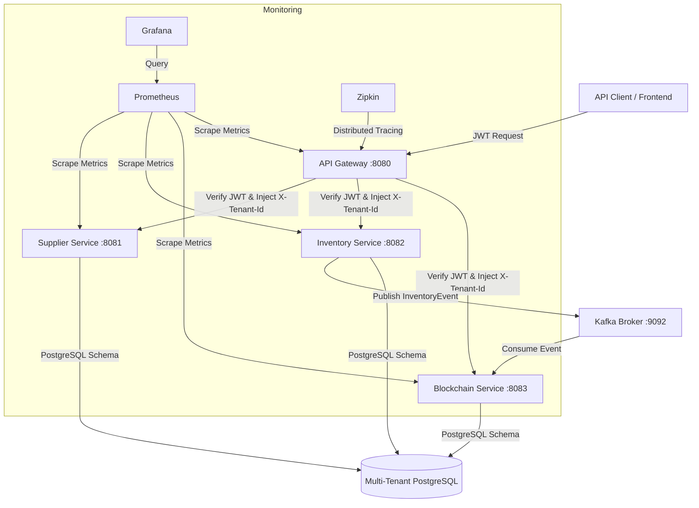

# Multi-Tenant Supply Chain & Private Blockchain Platform

Enterprise-grade **Multi-Tenant Supply Chain & Inventory Platform** with an immutable **Private Blockchain Audit Trail**. Built using Java 21, Spring Boot 3.3.x, Apache Kafka, PostgreSQL (Schema-per-Tenant model), Spring Cloud Gateway, Docker, and Micrometer (Prometheus + Grafana + Zipkin).

---

## 🏗️ Architecture & Flow



---

## 🛠️ Technology Stack

| Component | Technology |
|---|---|
| **Language** | Java 21 (LTS) |
| **Microservices Framework** | Spring Boot 3.3.x, Spring Cloud Gateway |
| **Security & Authentication** | Spring Security + JWT (HMAC-SHA256) |
| **Relational Database** | PostgreSQL 16 (Schema-per-tenant, connection-pooled) |
| **Database Migration** | Flyway (Multi-schema migration on startup) |
| **Message Broker** | Apache Kafka 3.7 (Partitioned by Tenant ID) |
| **Observability** | Micrometer, Prometheus, Grafana, OpenTelemetry, Zipkin |
| **Build Tool & Containers** | Maven (Multi-module), Docker, Docker Compose |

---

## 🔒 Multi-Tenancy Strategy (Schema-per-Tenant)

To support multiple enterprise clients securely in a single database, this project utilizes a **Schema-per-Tenant** architecture:
1. The **API Gateway** intercepts requests, validates the JWT, extracts the `tenantId` claim, and adds it as the `X-Tenant-Id` header.
2. Downstream services capture this header using `JwtAuthFilter` and store it in a thread-local `TenantContext`.
3. A custom `TenantRoutingDataSource` extends Spring's `AbstractRoutingDataSource` and routes database queries dynamically to the corresponding PostgreSQL schema (e.g. `toyota`, `honda`, `mitsubishi`, `daihatsu`) by appending `currentSchema=<tenant>` to the connection pool.
4. **Flyway** automatically runs migration scripts on startup across every tenant schema.

---

## 🔗 Private Blockchain Audit Ledger

To prevent data tampering and provide a cryptographically verifiable audit trail, every inventory movement (Receipt, Transfer, Issuance, Adjustment) generates a Kafka event.
* The **Blockchain Ledger Service** listens to `inventory-events`.
* On receiving an event, it builds a block with fields: `blockIndex`, `timestamp`, `payload` (the raw JSON event), `previousHash`, and `hash`.
* The block hash is calculated as:
  $$Hash = \text{SHA-256}(\text{Index} + \text{PreviousHash} + \text{Payload} + \text{Timestamp} + \text{TransactionNo})$$
* A REST endpoint `/api/blockchain/verify` allows auditors to trigger chain verification, validating that no block has been altered and that hash linkages remain intact.

---

## 🚀 Running the Platform

Ensure you have **Docker** and **Java 21** installed.

### 1. Build the Modules
```bash
mvn clean package -DskipTests
```

### 2. Start Infrastructure and Services
```bash
docker-compose up --build -d
```

This starts:
- **PostgreSQL** on port `5432`
- **Kafka / Zookeeper** on port `9092`
- **Zipkin** (Tracing) on port `9411`
- **API Gateway** on port `8080`
- **Supplier Service** on port `8081`
- **Inventory Service** on port `8082`
- **Blockchain Ledger Service** on port `8083`

### 3. Start Monitoring
```bash
docker-compose -f docker-compose.monitoring.yml up -d
```
- **Prometheus**: `http://localhost:9090`
- **Grafana**: `http://localhost:3000` (admin/admin)

---

## 🔑 Port & Endpoint Registry

| Service | Port | Base Path | Description | Key Endpoints |
|---|---|---|---|---|
| **API Gateway** | `8080` | `/` | Entrypoint & Auth Routing | `POST /api/auth/login` |
| **Supplier Service** | `8081` | `/api/suppliers` | Supplier Directory Management | `GET /api/suppliers`, `POST /api/suppliers` |
| **Inventory Service** | `8082` | `/api/inventory` | Transactions and Stock Balances | `POST /api/inventory/receipt`, `POST /api/inventory/transfer`, `POST /api/inventory/issue`, `GET /api/inventory/alerts` |
| **Blockchain Service** | `8083` | `/api/blockchain` | Cryptographic Ledger & Audit | `GET /api/blockchain/verify`, `GET /api/blockchain/blocks` |
