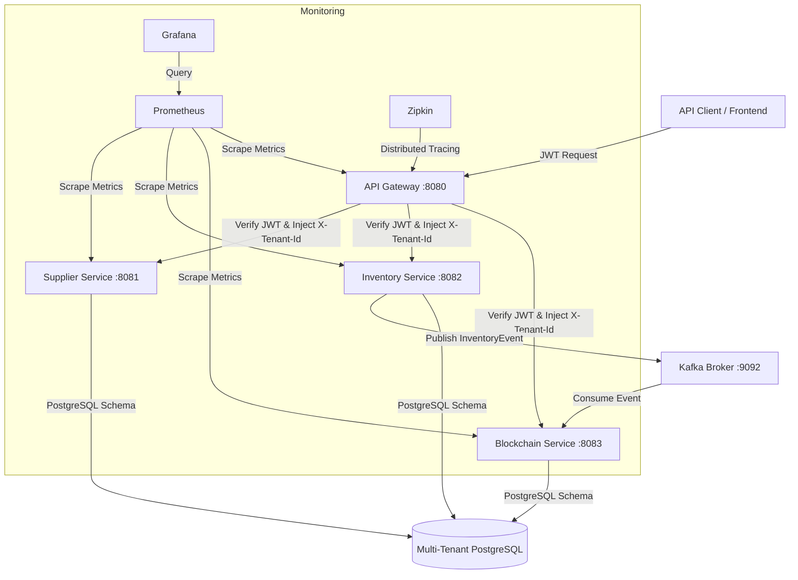

# Multi-Tenant Supply Chain & Private Blockchain Platform

Enterprise-grade **Multi-Tenant Supply Chain & Inventory Platform** with an immutable **Private Blockchain Audit Trail**. Built with Java 21, Spring Boot 3.3.x, Apache Kafka (KRaft), PostgreSQL (schema-per-tenant), Spring Cloud Gateway, Docker, and Micrometer (Prometheus + Grafana + Zipkin).

For the full Indonesian guide, see [README_ID.md](README_ID.md).

---

## Architecture



---

## Technology Stack

| Component | Technology |
|---|---|
| **Language** | Java 21 (LTS) |
| **Microservices** | Spring Boot 3.3.x, Spring Cloud Gateway |
| **Security** | Spring Security + JWT (HMAC-SHA256) |
| **Database** | PostgreSQL 16 (schema-per-tenant) |
| **Migration** | Flyway (multi-schema on startup) |
| **Message broker** | Apache Kafka 7.6 (Confluent image, KRaft — no ZooKeeper) |
| **Observability** | Micrometer, Prometheus, Grafana, Zipkin |
| **Build** | Maven (multi-module monorepo) |
| **Containers** | Docker Compose (runtime images only) |

---

## Build & Container Images

Compilation happens **on the host** with your local Maven installation. Service `Dockerfile`s are **runtime-only**: they copy the executable JAR from each module’s `target/` directory into a JRE image. Docker does **not** pull `maven:*` images or run `mvn` inside the build.

| Benefit | Detail |
|---|---|
| **Faster Docker builds** | No dependency download inside Docker layers |
| **Local Maven cache** | Reuses `~/.m2` (Linux/macOS) or `%USERPROFILE%\.m2` (Windows) |
| **Same workflow as IDE** | `mvn package` on the host matches what you run in the IDE |

**Prerequisites:** JDK 21, Maven 3.9+, Docker Desktop & Docker Compose v2+.

### Build all modules

From the repository root:

```bash
mvn clean package -DskipTests
```

This produces fat JARs under each service module, for example:

- `api-gateway/target/api-gateway-1.0.0.jar`
- `supplier-service/target/supplier-service-1.0.0.jar`
- `inventory-service/target/inventory-service-1.0.0.jar`
- `blockchain-ledger-service/target/blockchain-ledger-service-1.0.0.jar`

Build a single service (still installs `common` as needed):

```bash
mvn clean package -pl inventory-service -am -DskipTests
```

### Docker image layout

Each service `Dockerfile` uses `eclipse-temurin:21-jre-alpine`, copies `target/*.jar` to `app.jar`, and runs as a non-root user. **Run `mvn package` before `docker compose build`** — otherwise Docker has no JAR to copy and the image build fails.

---

## Running the Platform

### 1. Build JARs on the host

```bash
mvn clean package -DskipTests
```

### 2. Start infrastructure and services

```bash
docker compose up --build -d
```

`--build` rebuilds runtime images from the JARs in `target/`; it does not compile Java sources.

This starts:

| Component | Port | Notes |
|---|---|---|
| **PostgreSQL** | `5432` | Multi-tenant schemas |
| **Kafka** (KRaft) | `9092` (internal), `9094` (host) | `confluentinc/cp-kafka:7.6.1` |
| **Zipkin** | `9411` | Distributed tracing |
| **API Gateway** | `8080` | Entry point |
| **Supplier Service** | `8081` | |
| **Inventory Service** | `8082` | Publishes to Kafka |
| **Blockchain Ledger Service** | `8083` | Consumes from Kafka |

Check containers:

```bash
docker compose ps
```

### 3. Monitoring (optional)

```bash
docker compose -f docker-compose.monitoring.yml up -d
```

- **Prometheus:** http://localhost:9090  
- **Grafana:** http://localhost:3000 (`admin` / `admin`)

### Iterating after code changes

```bash
mvn clean package -DskipTests
docker compose up --build -d
```

Or rebuild one service:

```bash
mvn clean package -pl inventory-service -am -DskipTests
docker compose up --build -d inventory-service
```

### Tests (host Maven only)

```bash
mvn test
```

Integration tests that use Testcontainers still pull database/Kafka images during `mvn test`; application service images are not involved.

---

## Multi-Tenancy (Schema-per-Tenant)

1. The **API Gateway** validates the JWT, extracts `tenantId`, and adds `X-Tenant-Id`.
2. Downstream services store the tenant in `TenantContext` (thread-local).
3. `TenantRoutingDataSource` routes connections to the correct PostgreSQL schema (`toyota`, `honda`, `mitsubishi`, `daihatsu`, …).
4. **Flyway** migrates all tenant schemas on startup.

---

## Private Blockchain Audit Ledger

Inventory movements (receipt, transfer, issue, adjustment) publish `InventoryEvent` to Kafka. The **Blockchain Ledger Service** consumes events and appends SHA-256-linked blocks. Auditors can call `GET /api/blockchain/verify` to validate chain integrity.

---

## Port & Endpoint Registry

| Service | Port | Base path | Key endpoints |
|---|---|---|---|
| **API Gateway** | `8080` | `/` | `POST /api/auth/login` |
| **Supplier Service** | `8081` | `/api/suppliers` | `GET`, `POST /api/suppliers` |
| **Inventory Service** | `8082` | `/api/inventory` | `POST .../receipt`, `.../transfer`, `.../issue`, `GET .../alerts` |
| **Blockchain Service** | `8083` | `/api/blockchain` | `GET /api/blockchain/verify`, `GET /api/blockchain/blocks` |

---

## Project Layout

```
supply-chain-platform/
├── pom.xml                          # Parent POM
├── docker-compose.yml               # Postgres, Kafka, Zipkin, app services
├── docker-compose.monitoring.yml    # Prometheus & Grafana
├── common/                          # Shared library (DTOs, JWT, tenant context)
├── api-gateway/                     # Dockerfile → COPY target/*.jar
├── supplier-service/
├── inventory-service/
└── blockchain-ledger-service/
```

---

## CI/CD

GitHub Actions runs `mvn` on the runner (with Maven cache), then builds Docker images from pre-built JARs — the same host-build / runtime-image split as local development. See `.github/workflows/ci.yml`.
