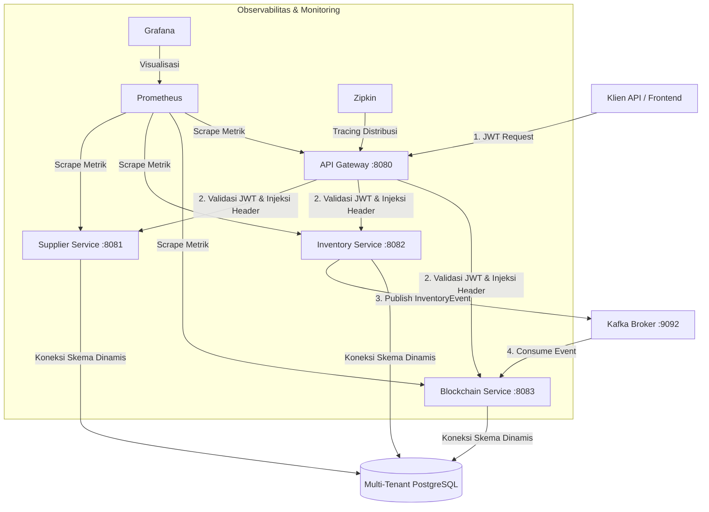

# Panduan Komprehensif: Platform Rantai Pasok & Audit Ledger Blockchain Multi-Tenant

Platform Rantai Pasok & Inventaris tingkat Enterprise berbasis **Multi-Tenant** dengan **Audit Trail Blockchain Privat** yang tidak dapat diubah (immutable). Proyek ini dirancang sebagai portofolio Senior Java Engineer, mengimplementasikan arsitektur mikro (microservices) modern yang kuat, aman, dan mudah dipantau.

Sistem ini dibangun menggunakan **Java 21**, **Spring Boot 3.3.x**, **Apache Kafka**, **PostgreSQL** (dengan pendekatan isolasi *Schema-per-Tenant*), **Spring Cloud Gateway**, **Docker**, serta ekosistem monitoring dan observabilitas penuh.

---

## 🏗️ 1. Arsitektur & Detail Layanan (Services Detail)

### Diagram Alur Sistem



### Penjelasan Alur Kerja Sistem (End-to-End Flow):
1. **Autentikasi & Routing**: Klien melakukan request dengan melampirkan JWT di header HTTP. **API Gateway** memvalidasi token tersebut, mengekstrak informasi tenant ID (`tenantId`), username (`sub`), dan role (`role`), lalu menginjeksikannya ke dalam header kustom (`X-Tenant-Id`, `X-Username`, `X-User-Role`) untuk diteruskan ke service di hilir.
2. **Propagasi Tenant (Database Isolation)**: Service hilir menerima request melalui filter `JwtAuthFilter`. Filter ini menetapkan tenant ID dalam ThreadLocal `TenantContext`. Saat Hibernate/Spring Data JPA menjalankan query, `TenantRoutingDataSource` mendeteksi tenant ID tersebut secara dinamis dan memilih skema database PostgreSQL yang sesuai (misal: `toyota`, `honda`, dll.).
3. **Penerbitan Event (Event Sourcing)**: Setiap kali transaksi inventaris berhasil diproses (misal: Penerimaan/Receipt), **Inventory Service** menyimpan data transaksi ke database lokal dan secara bersamaan memublikasikan `InventoryEvent` ke broker Kafka dengan kunci partisi berbasis `tenantId` untuk menjaga keurutan data.
4. **Audit Kriptografis (Blockchain Ledger)**: **Blockchain Ledger Service** mendengarkan pesan dari Kafka. Ketika pesan diterima, sistem mengaktifkan skema tenant yang sesuai dan membungkus event tersebut menjadi blok baru yang terenkripsi dan terhubung secara kriptografis ke blok sebelumnya menggunakan algoritma SHA-256.

### Rincian Peran Layanan (Services Detail)

1. **API Gateway (`api-gateway`)**
   - Menggunakan **Spring Cloud Gateway**.
   - Filter validasi JWT terpusat.
   - Ekstraksi `tenantId` dari JWT claims untuk disuntikkan ke header request hilir.
   - Pembatasan laju request (Rate Limiting).
   - Routing dinamis ke semua microservices.

2. **Supplier Service (`supplier-service`)**
   - Mengelola data master Supplier (operasi CRUD).
   - Validasi status supplier (Pending, Active, Suspended, Blacklisted).
   - REST API terdokumentasi untuk integrasi data supplier.

3. **Inventory Service (`inventory-service`) — Core Service**
   - Manajemen Material & Kategori Barang.
   - Manajemen Lokasi/Gudang fisik (Warehouse).
   - Mutasi stok inventaris (operasi CRUD & transaksi stok).
   - Mendukung tipe transaksi: `RECEIPT`, `TRANSFER`, `RESERVE`, `ISSUE`, `ADJUSTMENT`.
   - Mengirimkan event mutasi ke Apache Kafka.
   - Menyediakan fitur *Traceability Query* dan pengaman balapan data via *Optimistic Locking* dan *Idempotency Key*.

4. **Blockchain Ledger Service (`blockchain-ledger-service`)**
   - Bertindak sebagai consumer Kafka untuk event inventaris.
   - Membuat blok audit baru dengan enkripsi SHA-256 yang saling terhubung (blockchain).
   - Validasi integritas seluruh rantai blockchain (*chain integrity validation*).
   - Menyediakan API verifikasi status rantai untuk keperluan auditor.

---

## 🛠️ 2. Spesifikasi Teknologi (Tech Stack) & Fitur Keamanan

### Tabel Teknologi Utama

| Layer / Komponen | Teknologi yang Digunakan |
|---|---|
| **Language** | Java 21 (LTS) |
| **Framework** | Spring Boot 3.3.x / Spring Cloud |
| **Security** | Spring Security + JWT (JJWT 0.12) |
| **Messaging** | Apache Kafka 3.7 |
| **Database** | PostgreSQL 16 |
| **Migration** | Flyway (Multi-schema dynamic migration) |
| **ORM** | Spring Data JPA + Hibernate |
| **Observability** | Micrometer + Prometheus + Grafana |
| **Distributed Tracing** | OpenTelemetry + Zipkin |
| **Testing** | JUnit 5, Testcontainers, Mockito, MockMvc |
| **Containerization** | Docker + Docker Compose |
| **CI/CD Pipeline** | GitHub Actions |
| **Build Tool** | Maven |

### Fitur Keamanan & Standar Enterprise (Production Grade Features)

* **Stateless JWT Authentication & RBAC**: Autentikasi stateless menggunakan token JWT yang diamankan secara kriptografis. Otorisasi berbasis peran (RBAC) diterapkan secara ketat dengan anotasi `@PreAuthorize` pada level controller (Peran: `ADMIN`, `WAREHOUSE`, `AUDITOR`, `SUPPLIER`).
* **Multi-schema Database Isolation**: Data antar-penyewa (tenant) dipisahkan secara fisik pada tingkat skema (*schema-level isolation*) di PostgreSQL untuk mencegah kebocoran data.
* **Idempotency Guard**: Memanfaatkan `X-Idempotency-Key` unik berbasis UUID di setiap transaksi penulisan stok untuk mencegah eksekusi ganda akibat kegagalan jaringan atau retry dari klien.
* **Optimistic Locking**: Menggunakan kolom `@Version` JPA di tabel `inventory` untuk menangani persaingan update stok (*race condition*) dari transaksi yang berjalan bersamaan secara aman.
* **Kafka Reliable Delivery & DLQ**: Konfigurasi Kafka menggunakan `enable.idempotence=true` dan `acks=all` untuk memastikan tidak ada data transaksi yang hilang. Event yang gagal diproses setelah retry akan dialihkan ke Dead Letter Queue (DLQ) agar tidak menghambat aliran data utama.
* **Distributed Tracing**: Integrasi OpenTelemetry dan Zipkin untuk melacak jalur request end-to-end yang melewati berbagai microservices demi mempermudah debugging latensi.
* **Observabilitas & Metrik**: Metrik internal aplikasi diekspos melalui Micrometer/Prometheus Actuator dan divisualisasikan menggunakan dashboard Grafana yang dinamis.

---

## 📂 3. Struktur Modul & Folder Project (Monorepo)

Aplikasi ini diatur menggunakan struktur Maven Multi-Module dalam satu repositori (monorepo) untuk mempermudah manajemen dependensi, konfigurasi Docker, dan deployment terpadu:

```
supply-chain-platform/
│
├── pom.xml (Parent POM - Mengelola versi dependensi & modul anak)
├── docker-compose.yml (Infrastruktur PostgreSQL, Kafka, Zipkin, Gateway & App Services)
├── docker-compose.monitoring.yml (Infrastruktur Prometheus & Grafana)
├── README_ID.md (Dokumentasi Bahasa Indonesia)
├── .github/workflows/ci.yml (GitHub Actions CI/CD Pipeline)
│
├── common/ (Modul pustaka bersama yang digunakan oleh service hilir)
│   ├── pom.xml
│   └── src/main/java/com/supplychain/common/
│       ├── dto/ (ApiResponse.java - Format response REST standar)
│       ├── event/ (InventoryEvent.java - Payload event Kafka)
│       ├── exception/ (ResourceNotFoundException.java)
│       ├── security/ (JwtUtil.java - Validasi JWT di tingkat library)
│       └── tenant/ (TenantContext.java - Mengelola ThreadLocal tenant ID)
│
├── api-gateway/ (Layanan Routing & Centralized Security)
│   ├── pom.xml
│   ├── Dockerfile
│   └── src/main/
│       ├── java/com/supplychain/gateway/
│       │   ├── ApiGatewayApplication.java (Boot Gateway)
│       │   ├── config/ (SecurityConfig.java, JwtAuthGatewayFilter.java)
│       │   ├── controller/ (AuthController.java)
│       │   ├── dto/ (LoginRequest.java, AuthResponse.java)
│       │   └── service/ (AuthService.java)
│       └── resources/
│           └── application.yml (Definisi route routing mikro & rule gateway)
│
├── supplier-service/ (Layanan Pengelolaan Master Data Supplier)
│   ├── pom.xml
│   ├── Dockerfile
│   └── src/main/
│       ├── java/com/supplychain/supplier/
│       │   ├── SupplierServiceApplication.java
│       │   ├── config/ (JwtAuthFilter.java, TenantDataSourceConfig.java, SecurityConfig.java, FlywayTenantMigration.java)
│       │   ├── controller/ (SupplierController.java)
│       │   ├── entity/ (Supplier.java, SupplierContact.java)
│       │   ├── repository/ (SupplierRepository.java)
│       │   └── service/ (SupplierService.java)
│       └── resources/
│           ├── application.yml
│           └── db/migration/ (V1__init_supplier.sql)
│
├── inventory-service/ (Layanan Utama Mutasi Stok & Transaksi Gudang)
│   ├── pom.xml
│   ├── Dockerfile
│   └── src/main/
│       ├── java/com/supplychain/inventory/
│       │   ├── InventoryServiceApplication.java
│       │   ├── config/ (TenantDataSourceConfig.java, SecurityConfig.java, FlywayTenantMigration.java, KafkaProducerConfig.java)
│       │   ├── controller/ (InventoryController.java, MaterialController.java, WarehouseController.java, TraceabilityController.java)
│       │   ├── dto/ (ReceiptRequest.java, TransferRequest.java, IssueRequest.java, AdjustmentRequest.java, InventoryTransactionResponse.java)
│       │   ├── entity/ (Material.java, Warehouse.java, Inventory.java, InventoryTransaction.java, AuditLog.java)
│       │   ├── event/ (InventoryEventPublisher.java - Penerbit event Kafka)
│       │   ├── repository/ (MaterialRepository.java, WarehouseRepository.java, InventoryRepository.java, InventoryTransactionRepository.java, AuditLogRepository.java)
│       │   └── service/ (InventoryService.java, MaterialService.java, WarehouseService.java, TraceabilityService.java)
│       └── resources/
│           ├── application.yml
│           └── db/migration/ (V1__init_inventory.sql)
│
└── blockchain-ledger-service/ (Layanan Audit Immutable Ledger Kriptografis)
    ├── pom.xml
    ├── Dockerfile
    └── src/main/
        ├── java/com/supplychain/blockchain/
        │   ├── BlockchainLedgerApplication.java
        │   ├── config/ (TenantDataSourceConfig.java, SecurityConfig.java, FlywayTenantMigration.java, KafkaConsumerConfig.java)
        │   ├── controller/ (ChainVerificationController.java)
        │   ├── entity/ (Block.java)
        │   ├── event/ (InventoryEventConsumer.java - Pendengar Kafka)
        │   ├── repository/ (BlockRepository.java)
        │   └── service/ (BlockchainService.java)
        └── resources/
            ├── application.yml
            └── db/migration/ (V1__init_blockchain.sql)
```

---

## ⚡ 4. Implementasi Teknis Utama (Key Technical Implementations)

### Strategi Multi-Tenancy

Sistem menggunakan strategi **Schema-per-Tenant** dinamis. 
1. `TenantContext` berbasis `ThreadLocal` digunakan untuk menyimpan konteks penyewa saat ini dalam utas eksekusi.
2. `AbstractRoutingDataSource` diimplementasikan untuk mengalihkan koneksi database secara dinamis sesuai dengan tenant ID aktif.
3. JWT Claims berisi informasi penyewa:
   ```json
   {
     "sub": "user1",
     "tenantId": "toyota",
     "role": "WAREHOUSE"
   }
   ```
4. Migrasi database menggunakan **Flyway** yang diinisialisasi dinamis saat startup untuk bermigrasi di seluruh skema penyewa yang terdaftar.

### Alur Audit Blockchain Kriptografis

Setiap aktivitas mutasi stok penting diarsipkan ke dalam database audit terenkripsi.
- **Formula Hash**:
  ```java
  hash = SHA256(previousHash + transactionId + payload + timestamp)
  ```
- **Genesis Block**: Dibuat secara otomatis untuk setiap penyewa baru ketika rantai masih kosong.
- **Validasi Rantai**: Rantai diperiksa dari blok awal hingga akhir. Jika ada manipulasi data manual di database, hash tidak akan cocok dan status integritas menjadi `false`.

### Integrasi Aliran Data Kafka

```
[Inventory Service] ─── (Publish InventoryEvent) ───> [Kafka Topic: inventory-events]
                                                                │
                                                                ▼
                                                    [Blockchain Ledger Service]
                                                   (Membaca & Memvalidasi Event)
                                                                │
                                                                ▼
                                                    (Simpan Blok Audit Baru)
```

---

## 💾 5. Struktur Skema Database Per-Tenant

Database yang digunakan memiliki isolasi fisik tingkat skema (*schema-level isolation*). Skema database bawaan yang terdaftar di antaranya: `toyota`, `honda`, `mitsubishi`, dan `daihatsu`. Di dalam masing-masing skema tersebut, tabel-tabel berikut dibuat secara otomatis oleh Flyway:

### A. Skema Supplier Service
* **`suppliers`**: Menyimpan master data supplier.
  - `id` (BIGSERIAL, PK)
  - `supplier_code` (VARCHAR, UNIQUE)
  - `supplier_name` (VARCHAR)
  - `tax_number`, `email`, `phone`, `address`, `city`, `country`
  - `status` (VARCHAR - PENDING, ACTIVE, SUSPENDED, BLACKLISTED)
* **`supplier_contacts`**: Kontak penghubung dari supplier.
  - `id` (BIGSERIAL, PK)
  - `supplier_id` (FK to `suppliers`)
  - `contact_name`, `contact_email`, `contact_phone`, `role`
  - `is_primary` (BOOLEAN)

### B. Skema Inventory Service
* **`materials`**: Master data material/barang.
  - `id` (BIGSERIAL, PK)
  - `material_code` (VARCHAR, UNIQUE)
  - `material_name` (VARCHAR), `category` (VARCHAR), `uom` (VARCHAR)
  - `min_stock_level` (DECIMAL), `max_stock_level` (DECIMAL), `active` (BOOLEAN)
* **`warehouses`**: Daftar gudang fisik.
  - `id` (BIGSERIAL, PK)
  - `warehouse_code` (VARCHAR, UNIQUE), `warehouse_name` (VARCHAR), `warehouse_type` (VARCHAR)
* **`inventory`**: Saldo stok saat ini per kombinasi material dan gudang.
  - `id` (BIGSERIAL, PK)
  - `material_id` (FK), `warehouse_id` (FK)
  - `quantity` (DECIMAL), `reserved_quantity` (DECIMAL)
  - `version` (BIGINT) - **Kolom untuk mencegah balapan update data via Optimistic Locking (`@Version`)**
* **`inventory_transactions`**: Buku besar mutasi stok yang bersifat mutlak (*immutable*).
  - `id` (BIGSERIAL, PK)
  - `trx_no` (VARCHAR, UNIQUE)
  - `idempotency_key` (VARCHAR, UNIQUE) - **Kolom untuk memastikan operasi tidak diulang dua kali (Idempotency)**
  - `material_id` (FK), `source_warehouse_id` (FK), `destination_warehouse_id` (FK)
  - `trx_type` (RECEIPT, TRANSFER, ISSUE, ADJUSTMENT), `quantity` (DECIMAL), `performed_by` (VARCHAR), `trx_time` (TIMESTAMP)
* **`audit_logs`**: Catatan sistem untuk kepatuhan (compliance).
  - `id` (BIGSERIAL, PK)
  - `entity_name`, `entity_id`, `action_type`, `performed_by`, `tenant_id`, `details` (JSON)

### C. Skema Blockchain Ledger Service
* **`blockchain_blocks`**: Daftar blok audit trail kriptografis.
  - `id` (BIGSERIAL, PK)
  - `block_index` (BIGINT) - Urutan blok (Block Height)
  - `timestamp` (TIMESTAMP) - Waktu pembentukan blok
  - `payload` (VARCHAR(2000)) - Menyimpan salinan data mentah transaksi inventaris
  - `previous_hash` (VARCHAR(64)) - Hubungan hash ke blok sebelumnya
  - `hash` (VARCHAR(64), UNIQUE) - Hash SHA-256 dari blok saat ini
  - `transaction_no` (VARCHAR(50)) - Nomor transaksi inventaris terkait

---

## 🚀 6. Langkah-Langkah Menjalankan Project (Step-by-Step)

### Prasyarat System:
* Java Development Kit (JDK) 21
* Apache Maven 3.9+
* Docker Desktop & Docker Compose v2+

### Langkah 1: Kloning & Kompilasi Project
Pertama, lakukan instalasi module dependencies dan kompilasi package jar:
```bash
# Kompilasi seluruh module multi-module Maven dan lewati eksekusi pengujian sementara
mvn clean package -DskipTests
```

### Langkah 2: Jalankan Infrastruktur & Microservices via Docker Compose
Jalankan file docker-compose utama untuk mengaktifkan database PostgreSQL, Kafka broker, Zipkin (Tracing), serta seluruh container mikro:
```bash
# Menyalakan seluruh service di background
docker-compose up --build -d
```
Verifikasi status container dengan perintah:
```bash
docker-compose ps
```

### Langkah 3: Jalankan Monitoring & Observabilitas (Opsional)
Jika Anda ingin memantau performa platform, aktifkan ekosistem prometheus dan grafana:
```bash
docker-compose -f docker-compose.monitoring.yml up -d
```
Dashboard pemantauan yang kini aktif:
- **Prometheus UI**: `http://localhost:9090` (untuk melihat metrik mentah dan scrape target)
- **Grafana**: `http://localhost:3000` (untuk grafik visualisasi sistem, login default: `admin` / `admin`)
- **Zipkin UI**: `http://localhost:9411` (untuk melihat tracing latensi API antar layanan)

---

## 🧪 7. Skenario & Strategi Pengujian (Testing Strategy)

Proyek ini menerapkan pengujian berlapis mulai dari tingkat kode paling dasar hingga pengujian API terintegrasi secara dinamis.

### A. Unit Testing (Mockito & JUnit 5)
Fokus pengujian ini adalah menguji logika bisnis secara mandiri tanpa memerlukan infrastruktur luar seperti database atau broker Kafka aktif. Seluruh dependensi dieksekusi secara mock menggunakan Mockito.

* **Pengujian Inventory Service (`InventoryServiceTest.java`)**:
  - Memverifikasi bahwa data penerimaan material baru (`Receipt`) berhasil menambah saldo stok di tabel `inventory` dan menghasilkan event audit.
  - Memverifikasi mekanisme **Idempotensi**: Mengirim request berulang dengan `idempotencyKey` yang sama tidak boleh mengubah saldo stok dua kali, melainkan hanya mengembalikan transaksi yang sudah terbuat sebelumnya.
  - Memverifikasi validasi saldo stok pada transaksi pengeluaran material (`Issue`): Sistem harus melempar `IllegalStateException` jika jumlah pengeluaran melebihi saldo stok yang tersedia di gudang.

* **Pengujian Blockchain Service (`BlockchainServiceTest.java`)**:
  - Memverifikasi inisiasi otomatis **Genesis Block** (blok ke-0) ketika data rantai blok masih kosong di database.
  - Memverifikasi penambahan blok baru dan penghitungan SHA-256 yang valid berdasarkan blok sebelumnya.
  - Memverifikasi kegagalan verifikasi jika data blok mengalami perubahan tidak sah (tampering).

**Cara menjalankan Unit Tests:**
```bash
# Menjalankan seluruh pengujian unit di dalam project
mvn test
```

### B. Integration Testing (Testcontainers & Spring Integration)
Untuk menguji integrasi nyata dengan komponen database PostgreSQL dan broker Kafka tanpa memengaruhi database lokal, kami menggunakan **Testcontainers**:
* Library ini secara otomatis memutar container Docker database PostgreSQL dan container Kafka sementara pada saat proses kompilasi pengujian berjalan.
* Menguji interaksi database nyata seperti transaksi rollback jika terjadi kegagalan sistem.
* Menguji pengiriman event melalui broker Kafka dan dikonsumsi dengan benar oleh Blockchain service.

---

## 💻 8. Uji Coba Penggunaan Manual (Manual API Verification Scenario)

Berikut adalah skenario uji coba end-to-end API menggunakan tool cURL atau Postman.

### Skenario: Alur Kerja Penerimaan Barang oleh Tenant 'Toyota'

#### Langkah 1: Autentikasi Pengguna & Pengambilan Token JWT
Klien melakukan login melalui gateway untuk memperoleh JWT:
```bash
curl -X POST http://localhost:8080/api/auth/login \
  -H "Content-Type: application/json" \
  -d '{"username": "warehouse_user", "password": "password", "tenantId": "toyota"}'
```
*Ganti token JWT yang didapatkan dari response login untuk langkah-langkah di bawah.*

#### Langkah 2: Daftarkan Material Baru di Inventory Service
Daftarkan material bertipe baja ke database:
```bash
curl -X POST http://localhost:8080/api/materials \
  -H "Authorization: Bearer <GANTI_DENGAN_TOKEN_JWT>" \
  -H "Content-Type: application/json" \
  -d '{"materialCode": "MAT-STEEL-99", "materialName": "Baja Plat Ultra 2.0mm", "category": "Steel", "uom": "COIL", "minStockLevel": 5.0, "maxStockLevel": 50.0}'
```

#### Langkah 3: Lakukan Penerimaan Stok (Receipt) dengan Idempotency Key
Proses masuknya material dari supplier ke gudang 'WH-MAIN':
```bash
curl -X POST http://localhost:8080/api/inventory/receipt \
  -H "Authorization: Bearer <GANTI_DENGAN_TOKEN_JWT>" \
  -H "X-Idempotency-Key: PO-TRX-UNIQUE-KEY-001" \
  -H "X-Username: warehouse_user" \
  -H "Content-Type: application/json" \
  -d '{"materialId": 1, "warehouseId": 1, "quantity": 15.0, "supplierCode": "SUP-001", "purchaseOrderNo": "PO-2026-0001", "notes": "Pengiriman pertama baja"}'
```

#### Langkah 4: Cek Ledger Blockchain
Verifikasi bahwa event Kafka telah dikonsumsi dan tercatat sebagai blok terenkripsi di Blockchain Ledger Service:
```bash
curl -X GET http://localhost:8080/api/blockchain/blocks \
  -H "Authorization: Bearer <GANTI_DENGAN_TOKEN_JWT>"
```
Sistem akan mengembalikan deretan blok, termasuk blok transaksi `PO-TRX-UNIQUE-KEY-001` lengkap dengan hash-nya.

#### Langkah 5: Jalankan Audit Validasi Rantai Blok
Auditor dapat memverifikasi integritas seluruh rantai blockchain untuk memastikan tidak ada pemalsuan data:
```bash
curl -X GET http://localhost:8080/api/blockchain/verify \
  -H "Authorization: Bearer <GANTI_DENGAN_TOKEN_JWT>"
```
Response yang diharapkan jika data valid dan tidak termodifikasi:
```json
{
  "success": true,
  "message": "Blockchain integrity verified successfully — no tampering detected",
  "data": true
}
```
Jika terjadi kecurangan (misalnya ada database administrator yang mengubah jumlah kuantitas di database secara langsung tanpa melalui API), validasi di atas akan mengembalikan status `false` karena tanda tangan digital (hash) blok tersebut menjadi tidak cocok lagi.
